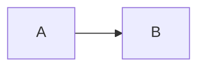

# LianMarkup 语法规范 (v0.1 草案)

基于 Markdown 改造, 砍掉冗余, 添加博客需要的原生语法

> 本文档只定义"语法长什么样"和"解析规则", 具体的字节流分析见 [如何读取文本流.md](./如何读取文本流.md)

---

## 0x00 总则

1. 文件使用 UTF-8 编码, 以 `\n` (0x0A) 为行结束符
2. **块级优先**: 解析器先按行首扫描块级语法, 再在块内容中二次扫描行内语法
3. **段落是默认语法**: 任何无法匹配的行都优雅回退为正文段落, 不产生解析错误
4. 行首关键字后必须紧跟 `0x20` (空格), 否则视为正文

   ```text
   # 这是标题
   #这只是文本, 因为没有空格
   ```

---

## 0x01 歧义与转义(三层防线)

写作者不应该和 `\` 搏斗, 所以转义符是最后手段:

**第一层: 回退规则**

行内定界符必须**成对出现且内容非空**才生效, 否则原样输出为文本:

```text
2*3=6 不是斜体, 因为 * 没有配对
** 也不是加粗, 因为内容为空
```

**第二层: 原样区域**

行内代码 `` ` `` 和原样块 `~~~` 内部不解析任何语法 (见 0x04, 0x05)

**第三层: 转义符**

`\` 仅在紧跟语法符号时生效, 让该符号恢复字面意义; 紧跟普通字符时 `\` 原样保留:

```text
\*\*不是加粗\*\*
路径 C:\Users 中的 \ 原样保留, 因为 U 不是语法符号
```

---

## 0x02 块级语法

### 标题

```text
# 一级标题
## 二级标题
###### 六级标题
```

支持可选的自定义锚点 (见 0x06):

```text
## 背景介绍 {#background}
```

### 引用块

```text
> 引用内容, 空行结束
> 可以有多行
```

### Callout 高级块

家族语法, 首行是标题, 后续行是正文, 空行 (0A 0A) 结束:

```text
>? 什么是 TCP?
TCP 是一种面向连接的传输层协议

>! 注意
生产环境不要开 debug 模式
```

| 前缀 | 语义 | 建议配色 |
|-|-|-|
| `>?` | 疑问块 | 蓝 |
| `>!` | 重要/警告块 | 红/橙 |
| `>+` | 提示/技巧块 | 绿 |
| `>x` | 错误/反例块 | 灰/红 |
| `>i` | 信息/补充块 | 青 |

### 折叠块

跨段落的容器, 有两种结束方式, 解析器通过 `>>>` 的下一行是否以 TAB (0x09) 开头来判定模式。

**模式在 `>>>` 处一次性判定, 之后互不跨界:**

- 显式配对模式: 只有行首的 `<<<` 是结束符, 缩进的 `<TAB><<<` 只是内容文本
- 缩进作用域模式: `<<<` 永远只是普通文本; 任何不以 TAB 开头的行都会结束折叠块, 并从该行开始恢复正常解析

**显式配对模式** (下一行不缩进, 用 `<<<` 结束):

```text
>>> 点击展开: 详细的推导过程
这段内容默认折叠。

可以包含多个段落、代码块、甚至嵌套的 >? 块。
<<<
```

**缩进作用域模式** (下一行以 TAB 开头, 缩进回退到行首即结束):

```text
>>> 点击展开: 详细的推导过程
	这段内容属于折叠块。
	每一行都以 TAB 开头。

	块内的空行不影响归属。
回到行首, 折叠块在这里已经结束。
```

`>>>+` 声明默认展开的折叠块, 两种模式通用:

```text
>>>+ 默认展开的配置说明
<<<
```

### 列表

```text
- 无序列表项
	- 嵌套项, 每级一个 TAB
- 第二项

1. 有序列表项
2. 第二项

- [ ] 待办事项
- [x] 已完成
```

> 嵌套统一用 TAB 分层, 不用空格, 和"行首分层级"的设计对齐

### 分割线

```text
---

___
```

两档分隔: `---` 是轻分割 (段落间的呼吸), `___` 是**幕间转换线** —— 比 `---` 更重的分隔, 用于文章里"换个世界"的时刻, 渲染为 `<hr class="lm-break">`, 视觉样式由 CSS 决定。(`***` 砍掉, 行内 `***` 保留为粗斜体嵌套)

### 注释

```text
// 这一行不会出现在渲染结果里
```

行首 `//` + 空格即注释行, 解析器直接跳过。段落中间的注释行会被悄悄移除(不打断段落), 容器块(引用/callout/折叠块)里同样有效。代码块和原样块里的 `//` 是内容, 不受影响。

> 文章是否发布 (draft) 是博客后台的元信息, 不属于语法。想在源码里藏东西, 就用注释。

### 分栏块

`|||` 围栏的分栏块: `===` 分栏, 段数即栏数:

```text
|||
左栏内容 (任意块级语法)

===
右栏内容

===
甚至第三栏
|||
```

渲染为 `<div class="lm-cols">`, 每栏一个 `.lm-col`。等宽还是比例、横排还是竖排 (移动端) 由 CSS 决定。

- 栏内可以写**任意块级语法** —— 展示"写法 | 效果"时, 左栏用 `~~~` 包源码即可
- 容器块 (分栏/折叠/callout/引用) 里的标题**不分配锚点、不进入目录**, `@toc` 不生效 —— 容器内容是嵌入物, 不属于文章结构 (旁注正常收集)

### 表格

沿用 Markdown 管道表格, 暂无改动:

```text
| 名称 | 说明 |
|-|-|
| toc | 目录 |
```

### 指令: 目录声明

`@` 开头的是**指令**, 不产生正文内容, 只影响文档结构或渲染:

```text
@toc depth=3
```

编译期收集所有标题块生成有序树, 渲染器输出为侧边栏组件。
"显示在左边还是右边"由博客的 CSS 决定, 不写进语法。

> `@` 指令家族可扩展, 比如未来可以有 `@draft`, `@aliases`, 但 v0.1 只定义 `@toc`

---

## 0x03 代码块

围栏代码块, 支持语言标记:

````text
```rust
fn main() {
    println!("hello");
}
```
````

语言标记为 `mermaid` 时特殊处理: 源码原样透传给前端渲染图表 (RSS 里退化为源码文本):

````text

````

语言标记为 `diff` 时, 按增删行渲染: `+` 开头是新增行 (绿), `-` 开头是删除行 (红), `@@` 开头是块头, 其余为上下文。diff 的行级解析在**集成层**完成 (解析器只透传语言标记, 见 0x0A):

````text
```diff
- 光图形壳就吃 1GB 内存
+ 核心内存占用不超 64MB
```
````

---

## 0x04 原样块

`~~~` 包裹的内容**完全不解析**, 原样输出:

```text
~~~
这里面 **不会加粗**, # 也不是标题
~~~
```

> 这是转义符的块级替代品, 写"介绍 LianMarkup 语法"的文档时全靠它

---

## 0x05 行内语法

| 语法 | 效果 |
|-|-|
| `` `代码` `` | 行内代码(不解析内部) |
| `**加粗**` | 加粗 |
| `*斜体*` | 斜体 |
| `***粗斜体***` | 加粗+斜体嵌套 |
| `~~删除线~~` | 删除线 |
| `==高亮==` | 高亮标记 |
| `[文字](https://url)` | 链接 |
| `` | 图片 |
| `[^备注内容]` | 旁注(见下) |
| `||剧透内容||` | 隐藏文本, 点击显示 |
| `$E=mc^2$` | 行内公式(见下) |
| `{漢字\|かんじ}` | 注音(见下) |
| `[文字]{.类名}` | 行内容器(见下) |

### 剧透

```text
凶手其实是||管家||。
```

渲染为模糊/遮盖的文本, 点击后显示。可以理解为折叠块的行内版本。

### 数学公式

使用 LaTeX 语法, 解析层**原样透传**, 渲染交给 KaTeX:

行内公式:

```text
质能方程 $E=mc^2$ 大家都很熟悉。
```

块级公式:

```text
$$
\int_{-\infty}^{\infty} e^{-x^2} dx = \sqrt{\pi}
$$
```

> `$` 是常见文本符号(价格、变量), 靠回退规则兜底: 不配对的 `$` 原样输出

### 注音 (ruby)

```text
{漢字|かんじ} 和 {汉字|hàn zì}
```

渲染为 HTML `<ruby>` 标签, 正文上方显示注音。竖线 `|` 前是正文, 后是注音。注音内容里需要字面量 `|` 时用 `\|` 转义。

### 图片属性

```text
{width=60%}
{group=旅行}
```

`{}` 内是可选属性: `width` 控制显示宽度(竖图友好), `group` 相同的图片在 lightbox 里归为一组, 支持左右切换。输出仍是普通 ``(属性进 data 属性), lightbox 由前端实现。

### 行内容器 (特效钩子)

```text
[抖动的文字]{.shake}
[渐变色的词]{.gradient from=#ff6b6b to=#4ecdc4}
```

`[文字]{.类名}` 渲染为 `<span class="lm-类名">`, 类名后可选的 `key=value` 参数变成 CSS 自定义属性 (`--key: value`)。**语法只提供钩子, 效果全部归 CSS**: 抖动、渐变、变色等动画由博客的 `@keyframes` 定义, 文章只声明参数, CSS 负责吃。

`{}` 家族的四种前缀: `|` 注音、`#` 锚点、`=` 属性、`.` 类名。

### 旁注 (脚注/作者备注)

内容就地书写, 不需要在文末维护定义:

```text
建立连接需要三次握手[^SYN、SYN-ACK、ACK 三个步骤], 之后才能传输数据。
```

渲染时: 正文中的触发词显示上标编号, 备注内容进入右侧边栏, JS 负责与触发位置纵向对齐。

---

## 0x06 ID 分配规则

**ID 是编译器和渲染器的事, 作者永远不碰它。**

1. 标题自动分配顺序编号锚点: `h-1`, `h-2`, `h-3`... (和 YukiLog 现有约定对齐)
2. 旁注锚点: 定义侧 `note-N`, 正文引用点 `noteref-N`, 由渲染器自动分配
3. 唯一例外: 需要被外部深链接引用的标题, 可用 `{#自定义id}` 显式覆盖

```text
## 2024 年终总结 {#year-2024}
```

> 产物结构和 class 命名的详细约定见 [产物契约.md](./产物契约.md)

---

## 0x07 Front Matter (仅工具用)

文件顶部可用 YAML front matter 携带文章元信息:

```text
---
title: 文章标题
slug: my-post
tags: [rust, parser]
---
```

**只作为导入/迁移工具的载体**: YukiLog 的文章元信息(标题/slug/分类/标签/摘要/封面)是数据库列, 不存正文里。导入工具读取后剥离, 存库的正文不含它。解析器在文件顶部遇到 front matter 时跳过, 或作为独立字段返回。

---

## 0x0A 两类语法: 解析器原生 vs 集成层增强

写作时不用区分, 但维护者需要知道每个语法在哪一层生效:

- **解析器原生**: `.ly` 源码直接解析成 HTML 的语法 (本文档 0x02~0x06 的绝大部分)
- **集成层增强**: 解析器只透传标记, 由 YukiLog 集成层或浏览器端二次处理 ——
  `mermaid` (前端 mermaid.js 画图)、`diff` (集成层按行渲染增删视图)、
  公式 `$...$` (前端 KaTeX)、`[文字]{.class}` (CSS 定义效果)、
  图片 `group` (前端灯箱分组) 与代码高亮 (服务端 syntect)

新增"增强型"语法时, 解析器侧通常只需要一个不冲突的标记, 真正的渲染逻辑写在集成层。

---

## 0x08 从 Markdown 砍掉的东西

| 砍掉的 | 理由 |
|-|-|
| Setext 标题 (`===`/`---` 下划线式) | 和 `#` 重复, 还和分割线撞车 |
| 引用式链接 `[text][id]` + 文末定义 | 内容和定义分离, 维护是负担 |
| 引用式脚注 `[^1]` + 文末定义 | 同上, 被就地书写的 `[^内容]` 旁注替代 |
| **内嵌 HTML** | 砍死。没有逃生舱, 才能逼着语法原生进化(折叠块就是这么来的) |
| `_斜体_` | `snake_case` 噩梦, 只留 `*` |
| `***` 分割线 | 只留 `---` (行内 `***` 保留为粗斜体嵌套); `___` 后来作为幕间转换线复活, 见 D17 |

> 博客文章会全面重构, 不追求 Markdown 兼容, 放开手设计
>
> 后记: 曾规划的 `[[slug]]` 站内链接和 `>^` 块级长备注也已砍掉, 理由见 [设计决定.md](./设计决定.md) D13

---

## 0x09 待定 / 脑洞区

还没想清楚, 先记下来:

- `@no-toc` 关闭目录: 短文章可能需要, 等真实场景出现时实现
- `{` 的行内用法现在有三种: 注音 `{a|b}`、图片属性 `{width=60%}`、标题锚点 `{#id}`, 靠上下文区分, 写解析器时注意分支顺序
